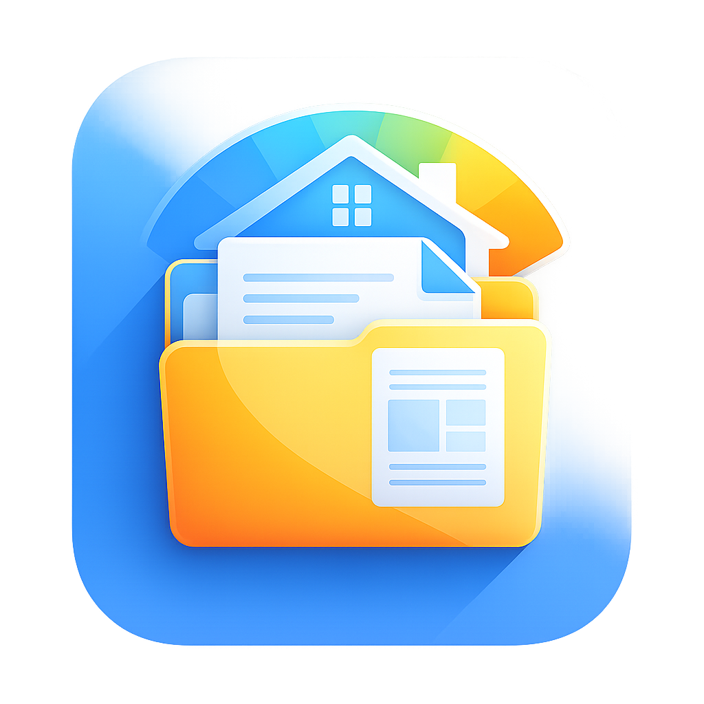
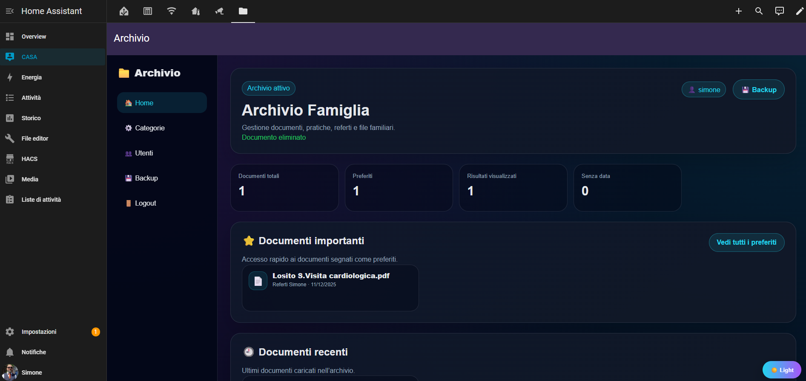
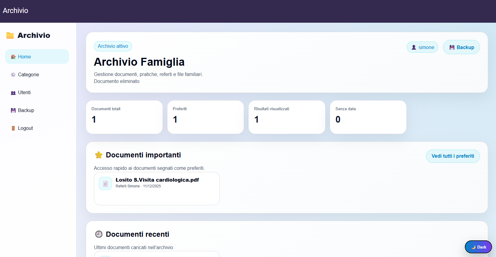
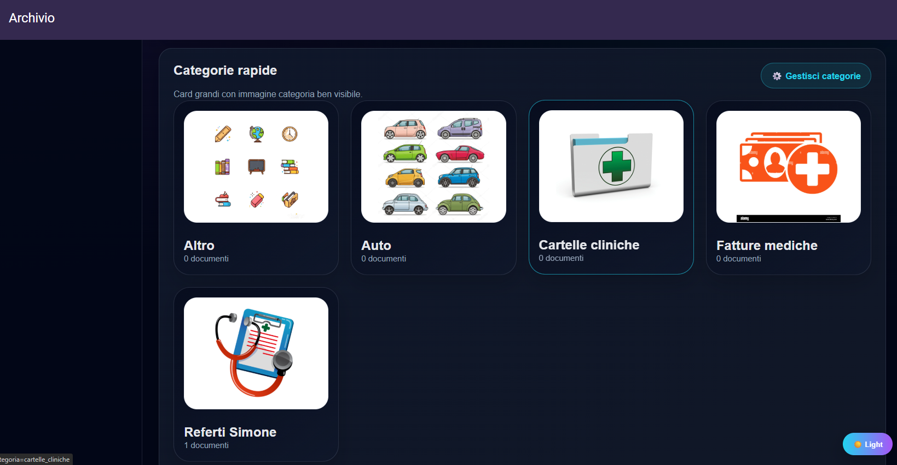

# 📁 Archivio Famiglia

<p align="center">
  
</p>

<p align="center">
  
  
  
  
</p>

<p align="center">
  <b>Archivio documentale familiare per Home Assistant</b><br>
  by <b>SimoncinoProjects / Simone Losito</b>
</p>

---

## ✨ Cos’è

**Archivio Famiglia** è un add-on Home Assistant per gestire documenti familiari, pratiche, referti, bollette, file casa, auto e documenti importanti.

Permette di caricare, cercare, visualizzare, scaricare, modificare e condividere documenti da browser, smartphone o tablet.

---

## 🖼️ Anteprima

### 🌙 Tema Dark

<p align="center">
  
</p>

### ☀️ Tema Light

<p align="center">
  
</p>

### 📂 Gestione categorie

<p align="center">
  
</p>

---

## ✅ Funzioni principali

- 📂 Gestione categorie con immagini
- 📄 Upload documenti
- 📷 Upload foto da smartphone con fotocamera
- 👁️ Anteprima PDF e immagini
- ⬇️ Download documenti
- ✏️ Modifica dati documento
- 🗑️ Eliminazione documenti
- ⭐ Preferiti
- 🔎 Ricerca per nome, categoria, tag, note, data, anno e mese
- 👥 Gestione utenti
- 🔐 Ruoli admin/user
- 🔗 Link pubblici temporanei
- 💾 Backup database e file
- 🌙 Tema dark
- ☀️ Tema light
- ℹ️ Pagina info con statistiche
- 🏠 Integrazione Home Assistant

---

## 🚀 Installazione su Home Assistant

1. Vai in **Impostazioni → Componenti aggiuntivi → Add-on Store**
2. Clicca sui **tre puntini** in alto a destra
3. Apri **Repository**
4. Inserisci questo URL:

```text
https://github.com/simone-losito/archivio-famiglia-addon
